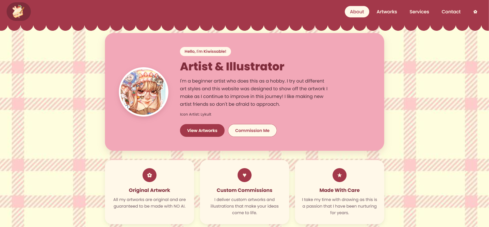

# The Sweet Layers of Art

This is to showcase my artwork and commission services.

- **Live site:** https://final-project-manalo.onrender.com/
- **API:** https://art-portfolio-backend-f7ga.onrender.com/healthz
- **Demo video:** https://drive.google.com/file/d/1v-fEdrwKHwigeUz-dWM5YgmOjTSh0A2c/view?usp=sharing




## What it does

- Introduces me on the home page, with a carousel of my three most recent artworks
- Browse every artwork added, newest first, and filter by category
- Click an artwork to view the full, uncropped image with its details
- Add, edit and delete artworks (admin only)
- View commission services with example images, plus my terms of service
- Add, edit and delete commission services (admin only)
- Contact page with my email and social links
- Admin login and logout from the navbar; visitors see a read-only site

## Built with

React and Vite on the front end, Express and PostgreSQL on the back end. The
client is on Render, the API on Render, the database on Supabase.

## Running it yourself

**The client only, in demo mode.** No database needed.

    cd client
    npm install
    cp .env.example .env        # VITE_USE_MOCK_API stays true
    npm run dev                 # http://localhost:5173

**The whole stack.** 

    Before Running the project, make sure you have:
    Node.js
    npm
    A supabase project
    A render project

    # 1. the database
    Create a supabase project and create a new bucket in storage with the name '/uploads'
    This stores the images that the website uploads.

    # 2. the API
    cd server
    npm install
    cp .env.example .env        # check DATABASE_URL and input any missing values.
    npm start

    # 3. the client, in another terminal
    cd client
    npm install
    cp .env.example .env        # Input any missing values and deploy the client into render for the links.
    # set VITE_USE_MOCK_API=false
    npm run dev

## Environment variables

| Name | Where | What it is |
| --- | --- | --- |
| `DATABASE_URL` | server | PostgreSQL connection string. Contains a password |
| `CORS_ORIGINS` | server | comma-separated origins allowed to call the API |
| `NODE_ENV` | server | `production` on your host |
| `ADMIN_PASSWORD` | server | Serves as the password for admin. Set it yourself. |
| `JWT_SECRET` | server | A random string that serves as a password for tokens. Set it yourself. |
| `SUPABASE_URL` | server | Find this in your supabase project. |
| `SUPABASE_SERVICE_ROLE_KEY` | server | Find this in your supabase project. |
| `VITE_USE_MOCK_API` | client, at build time | only `false` turns demo mode off; unset means on |
| `VITE_API_BASE_URL` | client, at build time | your API's public URL, no trailing slash |


## Deploying

**FRONT-END**

The React Front-end is deployed in Render.

1. Connect the github repository to render.
2. Set the root directory to client.
3. Configure the environment variables including the API URL.
4. Deploy the project. Render will build the front end and re-deploy based on recent commits.

**BACK-END**

The Express.js Back-end is deployed in Render.

1. Connect the github repository to render.
2. Set the root directory to client.
3. Configure the environment variables including the Frontend URL and SUPABASE credentials.
5. Deploy the project. Render will build the back-end and re-deploy based on recent commits.
4. Ensure that the API is running using /healthz.

**Database and Authentication**

Supabase manages the application's database and authentication. You must configure the required database tables, authentication settings, and Row Level Security (RLS) policies in your Supabase project yourself.

**Environment Variables**

Keep environment variables and secret keys out of the repository. Configure them locally for development and in the appropriate hosting dashboards for deployment. Keep .env in gitignore.

## Project structure

```
Project structure:
└── kish-mnlo-final-project-manalo/
    ├── README.md                  
    ├── AI-USAGE.md                
    ├── compose.yml
    ├── LICENSE
    ├── package.json
    ├── .env.example
    ├── client/                             # Houses the Front-end and includes the API.
    │   ├── index.html
    │   ├── package.json
    │   ├── vite.config.js
    │   ├── .env.example
    │   └── src/
    │       ├── App.jsx
    │       ├── Footer.jsx
    │       ├── main.jsx
    │       ├── Navbar.jsx
    │       ├── styles.css
    │       ├── api/
    │       │   ├── artworkSeed.json
    │       │   ├── categorySeed.json
    │       │   ├── httpApi.js
    │       │   ├── index.js
    │       │   ├── mockApi.js
    │       │   └── serviceSeed.json
    │       └── pages/
    │           ├── Artworks.jsx
    │           ├── Commission.jsx
    │           ├── Contact.jsx
    │           └── Home.jsx
    └── server/                            # Houses the back-end.
        ├── artworksRepo.js
        ├── categoryRepo.js
        ├── package.json
        ├── server.js
        ├── serviceRepo.js
        ├── .env.example
        └── db/
            ├── pool.js
            ├── run.js
            ├── schema.sql
            └── seed.sql

```

## Architecture

The React client (Render) is the only thing visitors load. It talks to the Express API over HTTP, and the API is the only piece that talks to PostgreSQL, through the repository files in server/ (artworks, categories and services). Image uploads go to the API along with the form data. In demo mode, the client's mockApi.js stands in for the API and keeps everything in the browser's localStorage, so the server and database are not needed.

## What I would do next

- **Add a unique landing page**: Create a landing page that can attract attention to the viewer.
- **Enhance Design**: Add more elements such as symbols or images around the website to make it look more friendly.
- **Add more interactables**: Figure out more features to be added for interaction such as a commission queue.
- **Draw more Artworks**: Be able to show more artworks for people to admire in the artwork gallery.

## Author

Manalo, Kisha Margarette B. 
https://github.com/Kish-Mnlo 
CS - 403

## Licence

MIT, see [LICENSE](LICENSE).

## AI usage
- Assisted by ChatGPT

Link to the `AI-USAGE.md` in my project repository:
https://github.com/Kish-Mnlo/final-project-MANALO/blob/main/AI-USAGE.md
